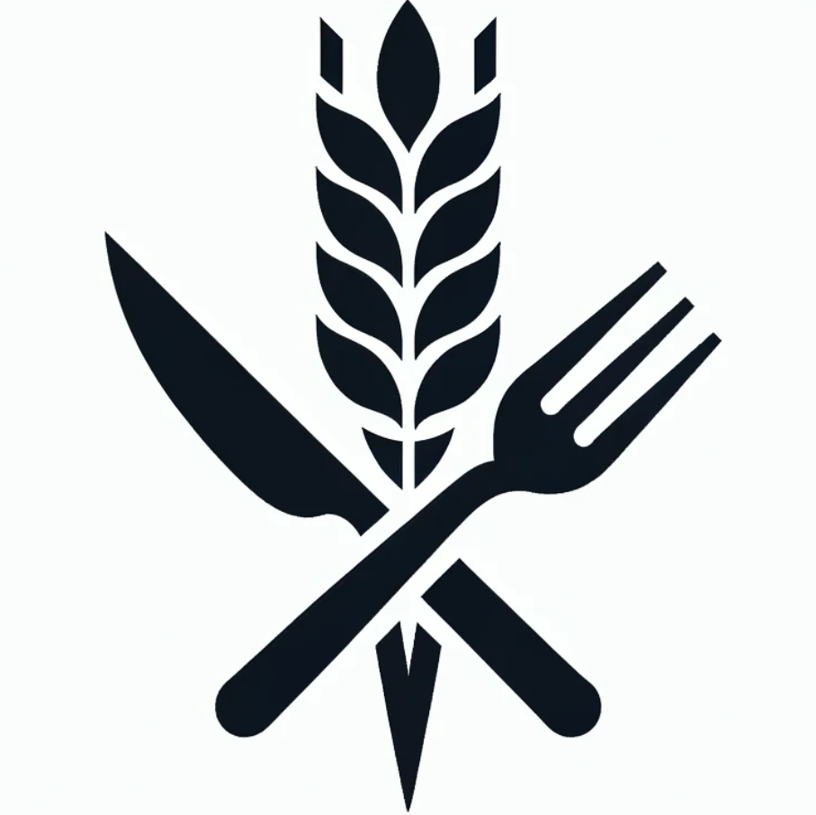

# #AutarkieIndex

## Needs, not wants. Availability, not ownership.

The **#AutarkieIndex focuses on needs, not wants.** It does not measure what we own. It investigates what remains available to meet essential needs when conditions change — including when familiar infrastructures fail.

**The purpose is clear. The dimensions are still being developed.**

We want to make dependencies visible and test whether people and communities can continue to meet essential needs under stress. The index is intended to support observation, comparison, collective learning and practical decisions — not to proclaim self-sufficiency or assign a final score before we know what should be measured.

## Initial areas of investigation

- **Energy** — Can essential energy needs still be met?
- **Food** — Can essential food needs still be met?
- **Emergency health** — Does essential medical help remain accessible in an emergency?
- **Q102014** — Can the data and coordination infrastructure needed to observe, verify and act remain available?

These are **starting points, not a closed list of dimensions**. Q102014 also serves as an enabling infrastructure across the areas of investigation; it is not simply another consumption category.

## Open questions

1. How can we distinguish needs from wants in ways that can be discussed and tested?
2. Which other needs and dependencies must be considered?
3. What does *available* mean under different conditions — and to whom?
4. Which observations and indicators reveal actual availability rather than nominal ownership or capacity?
5. Which stress tests reveal what still works when normal infrastructure does not?
6. How do we keep the data, methods and assumptions open to scrutiny and revision?

## Working method

#AutarkieIndex is part of **#PlanD**:

**OBSERVE → PARAMETRIZE → ENABLE → TEST**

We start by observing actual needs, resources and dependencies. We develop parameters rather than treating early categories as permanent. We enable practical alternatives and test what holds under changed conditions. Results should feed back into the next cycle.

## Open work in progress

This repository is a public place to formulate questions, develop candidate dimensions and indicators, document methods, and publish stress tests as they become available. **No validated index or tested results are claimed here yet.**

- Project: [2030.autarkieindex.org](https://2030.autarkieindex.org/)
- Framework: [#PlanD](https://github.com/sms2sms/PlanD)
- Data and coordination setting: [Q102014 / setting](https://github.com/Q102014/setting)

## Reuse

This repository is released under **CC0 1.0 Universal** (see `LICENSE`). Contributions and reuse are welcome.
